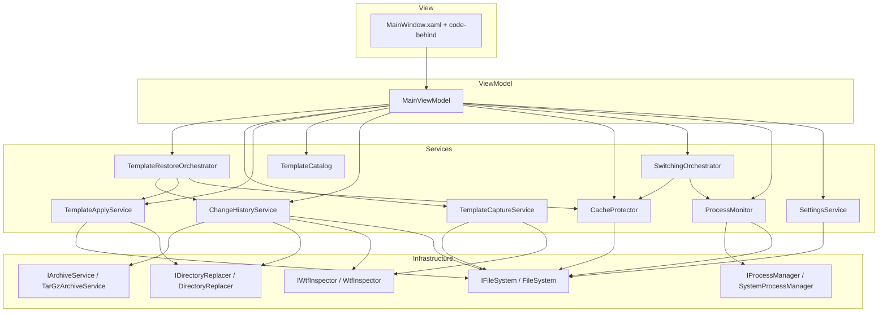
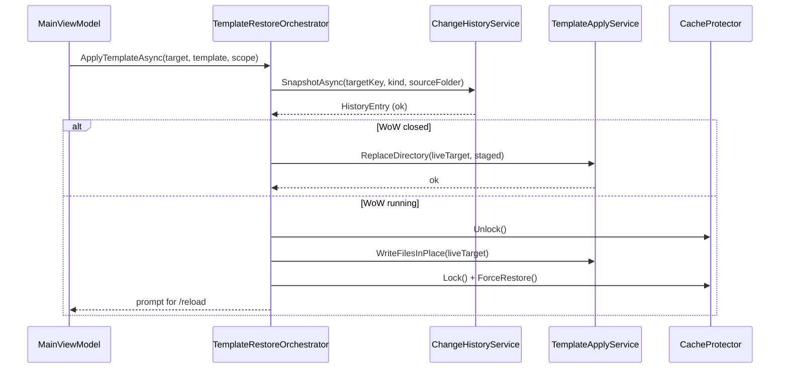

# HearthSwing Architecture

This document describes the architecture of the **HearthSwing** app (v1.0) —
a WPF desktop application for capturing, applying, and recovering WoW Classic
Anniversary settings in the live `WTF` folder.

---

## 1. Principles

1. **Single project, MVVM.** Models → Services → ViewModels → Views. Views are
   the only layer that knows about WPF controls; business logic never lives in
   XAML code-behind.
2. **Interface-first service layer.** Services depend on interfaces
   (`IFileSystem`, `IProcessManager`, `IArchiveService`, `IWtfInspector`, ...),
   registered once in `App.ConfigureServices()` and resolved via constructor
   injection.
3. **Filesystem and process access are abstracted.** No `File.*` /
   `Directory.*` statics and no direct `Process` calls in service code — this is
   what makes the service layer unit-testable.
4. **History before mutation.** Every write that overwrites live `WTF` content
   must complete an `IChangeHistoryService` snapshot of every affected target
   first. This is a non-optional invariant, enforced by
   `ITemplateRestoreOrchestrator`.
5. **Templates are the only transfer mechanism.** No saved accounts, no profile
   switching, no profile filters. Top-level UI modes: `Templates` and `History`.
6. **Rollback-aware filesystem mutation.** Closed-game directory replacement
   goes through `IDirectoryReplacer` (rollback-aware); running-WoW applies write
   files in place and never swap folders.
7. **Cache protection is layered.** Read-only lock + in-memory backup +
   `FileSystemWatcher` recovery + timestamp touch.

---

## 2. Module overview

### 2.1 Views (root XAML)

- `MainWindow.xaml` — the whole UI: segmented `Templates | History` mode switch,
  template cards, history tree, settings overlay, confirmation dialogs, toasts.
- `MainWindow.xaml.cs` — visual-tree manipulation only (button highlighting,
  scroll-to-end). No business logic.
- `App.xaml` / `App.xaml.cs` — resources (`BoolToVis`, `InverseBoolToVis`,
  brushes, button styles) and `ConfigureServices()` DI registration.

### 2.2 `ViewModels/MainViewModel.cs`

Coordinates UI state and commands. Owns the log sink (`AppendLog`,
`[HH:mm:ss] message\n`), subscribes to service `Log` events via method groups,
and manages the `CancellationTokenSource`s for the unlock countdown and process
monitoring. It does **not** contain template, history, filesystem, or process
business logic.

### 2.3 Service layer

| Service | Responsibility |
|---|---|
| `TemplateCatalog` | Metadata + content for templates under `<ProfilesPath>/.templates/<id>/` |
| `TemplateCaptureService` | Capture account templates and tokenized character templates (`Shared/` = account-scoped) |
| `TemplateApplyService` | Apply with `TemplateApplyScope.Full`/`CacheOnly`; rollback-aware directory replacement when closed, targeted in-place writes when running |
| `TemplateRestoreOrchestrator` | Snapshot all affected targets through `IChangeHistoryService`, then apply; live path = `Unlock -> apply -> Lock -> ForceRestore` + `/reload` prompt |
| `ChangeHistoryService` | Bounded tar.gz archives + `index.json` under `<ProfilesPath>/.history/<target-key>/`; snapshot/list/restore/delete |
| `CacheProtector` | Read-only lock + in-memory backup + `FileSystemWatcher` restore + timestamp touch (`IDisposable`) |
| `SwitchingOrchestrator` | Cache and launch only: lock for launch, unlock, force-restore protected cache, cleanup after WoW exits |
| `ProcessMonitor` | Detect/launch `WowClassic.exe`, monitor process exit |
| `SettingsService` | `AppSettings.json` next to the executable; auto-detect `GamePath` walking up for `WowClassic.exe` |
| `LegacyDataCleanupService` | One-time migration cleanup of obsolete data (`ILegacyDataCleanupService`) |

### 2.4 Infrastructure abstractions

| Interface | Production impl | Purpose |
|---|---|---|
| `IFileSystem` | `FileSystem` | All filesystem I/O (never `File.*`/`Directory.*` statics) |
| `IProcessManager` | `SystemProcessManager` | `Process.GetProcessesByName`, `Process.Start` |
| `IArchiveService` | `TarGzArchiveService` | tar.gz compress/extract for history archives |
| `IDirectoryReplacer` | `DirectoryReplacer` | Rollback-aware directory replacement (closed game only) |
| `IWtfInspector` | `WtfInspector` | Locates/classifies WoW `WTF` targets (accounts, characters) |
| `ITemplateFileClassifier` | `TemplateFileClassifier` | Decides which files belong to a template scope |
| `ITemplateTokenizer` | `TemplateTokenizer` | Character/realm tokenization in character templates |

---

## 3. Templates & History data flow

### 3.1 Capture

1. User picks a donor (account or character) and a template type.
2. `TemplateCaptureService` reads the live `WTF` tree via `IWtfInspector`.
3. Account templates → account-scoped files; character templates → tokenized
   character subtree + optional `Shared/` account payload.
4. `TemplateCatalog` stores metadata + content under `<ProfilesPath>/.templates/<id>/`.

### 3.2 Apply (WoW closed)

1. `TemplateRestoreOrchestrator` resolves every affected target.
2. It snapshots each target through `IChangeHistoryService` **first**.
3. `TemplateApplyService` uses `IDirectoryReplacer.ReplaceDirectory()`
   (rollback-aware) to swap the live target content.

### 3.3 Apply (WoW running)

1. `TemplateRestoreOrchestrator` snapshots every affected target first.
2. `CacheProtector.Unlock()` — release read-only locks so files can be written.
3. `TemplateApplyService` writes targeted files **in place** (no folder swap).
4. `CacheProtector.Lock()` re-establishes protection, then `ForceRestore()`
   restores protected cache files from the in-memory backups.
5. The user is prompted to run `/reload` in WoW.

### 3.4 History restore (offline)

1. The UI requires WoW to be closed.
2. Resolve the current live target, snapshot it again (so the restore is itself
   recoverable).
3. `IDirectoryReplacer` restores the archive content onto the live target.

---

## 4. Cache protection

`CacheProtector` implements four layers (see `.ai/skills/cache-protection/SKILL.md`):

1. **Read-only lock** — `FileAttributes.ReadOnly` on each protected file.
2. **In-memory backup** — bytes kept in `_backups` (keyed by path, case-insensitive).
3. **FileSystemWatcher recovery** — `Changed`/`Created` handlers restore the
   backup when WoW or server sync writes the file. Callbacks run on a threadpool
   thread — IO only, never UI.
4. **Timestamp touch** — `LastWriteTime` updated so WoW prefers the local file.

`CacheFilePatterns.All` is the single source of truth for protected file names
(`bindings-cache.wtf`, `config-cache.wtf`, `macros-cache.txt`,
`edit-mode-cache-*.txt`, `tts-cache-*.txt`, `chat-cache.txt`,
`chat-frontend-cache.txt`, `flagged-cache-account.txt`, `layout-local.txt`,
`cache.md5`).

---

## 5. Process management

- `IProcessManager` abstracts `Process.*` statics.
- `ProcessMonitor` detects `WowClassic` (process name), launches
  `WowClassic.exe` from `GamePath` (`UseShellExecute = true`), and waits for
  exit by polling `GetProcessesByName` with a 2 s delay (cancellation-aware).
- `SwitchingOrchestrator` drives the launch sequence with cache protection:
  lock → launch → unlock → force-restore → cleanup after exit.

---

## 6. Edge cases

| Situation | Behavior |
|---|---|
| Template applied while WoW is running | In-place writes, cache unlock/lock/force-restore, `/reload` prompt — no folder swap |
| History restore while WoW is running | Blocked in the UI (offline operation) |
| Target overwritten without a snapshot | Impossible by design — the orchestrator snapshots before every mutation |
| Cache file overwritten by WoW/server sync | `FileSystemWatcher` restores it from the in-memory backup; read-only attribute stays set |
| Character template with account-scoped payload | Separate snapshots of character subtree AND account subtree |
| Staging/overwrite hits a read-only file | Read-only attributes cleared before overwrite/delete |
| More history entries than `MaxHistoryEntriesPerTarget` (default 20) | Bounded — oldest entries pruned |
| WoW exits after a launch | `SwitchingOrchestrator` cleans up / restores cache state |

---

## 7. Key decisions (ADR style)

1. **Templates are the only transfer mechanism.** Saved accounts / profile
   switching / profile filters were removed. Two top-level modes only:
   `Templates` and `History`.
2. **Snapshot-before-mutation is a hard invariant.** Not an option, not skippable.
   Implemented once in `TemplateRestoreOrchestrator` so no ViewModel can bypass it.
3. **Directory replacement only when WoW is closed.** Running WoW holds files
   open and would fight a folder swap; in-place targeted writes + cache
   force-restore + `/reload` is the safe live path.
4. **History restore is offline-only.** It uses `IDirectoryReplacer` and must
   never run while the game is live.
5. **Cache protection is layered, not single-mechanism.** Read-only alone is
   bypassable; watchers alone are race-prone; the combination plus timestamps is
   the proven design.
6. **Filesystem/process/archive behind interfaces.** Enables the NUnit service
   tests (no real I/O in unit tests).
7. **`SwitchingOrchestrator` scope is cache + launch.** It deliberately does not
   regain account-switching responsibilities.

---

## 8. Testing architecture

- `HearthSwing.Tests/` mirrors the source folders (`Services/`, `ViewModels/`).
- NUnit + AutoFixture (AutoNSubstitute) + NSubstitute + Shouldly; Arrange /
  Act / Assert.
- `_fixture.Freeze<T>()` in `[SetUp]`, SUT constructed with injected substitutes.
- No real filesystem/process/archive I/O in unit tests.
- Template restore tests verify: History snapshots complete before apply,
  running-WoW paths avoid directory replacement, cache protection is
  re-established after a live apply.

---

## 9. Future direction

Plans and implementation prompts live in `.ai/docs/`
(`character-template-mode-plan.md`, `templates-profiles-implementation-prompt.md`,
`templates-ux-improvement-plan.md`, `wtf-history-implementation-prompt.md`,
`wtf-history-redesign-plan.md`). When the design changes, update
`CONTEXT.md`/`ARCHITECTURE.md` **first** (contract-first), then code.
